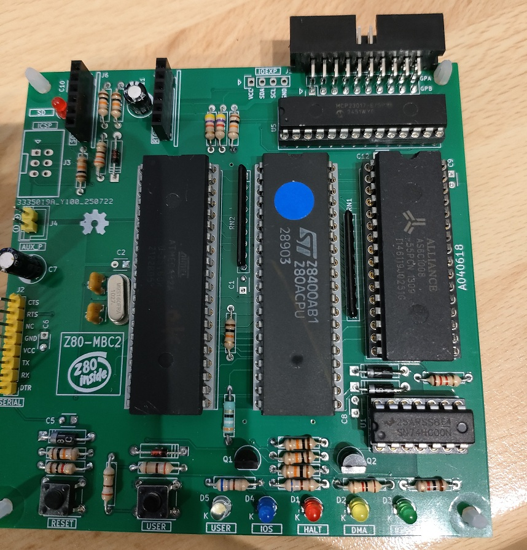
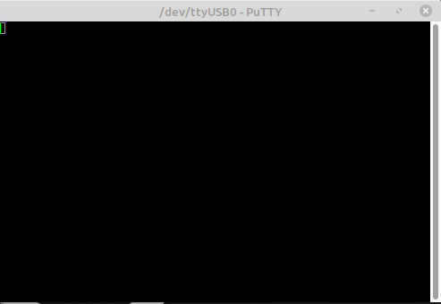
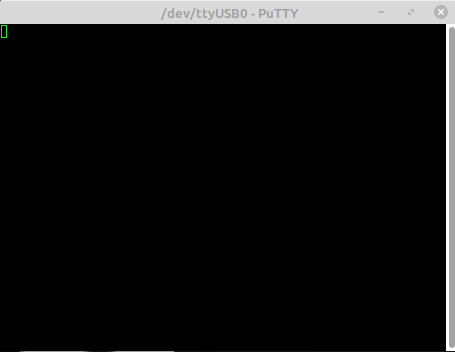
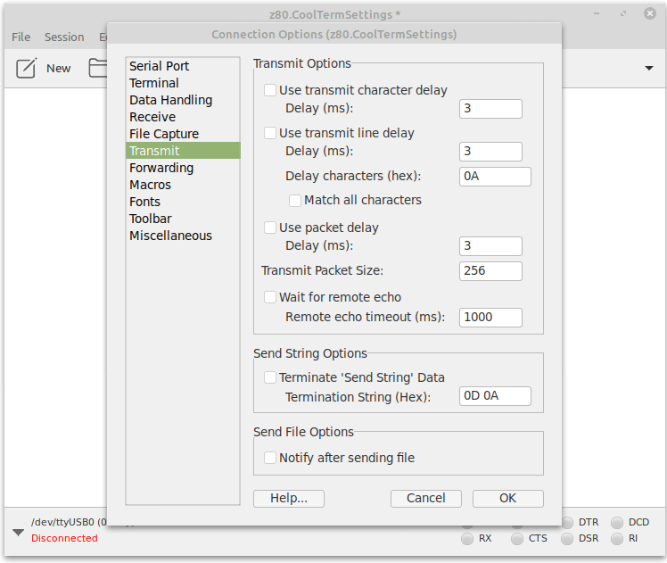

# Z80-MBC2

Le [Z80-MBC2](https://hackaday.io/project/159973-z80-mbc2-a-4-ics-homebrew-z80-computer) est un ordinateur monocarte (SBC) Z80 facile à assembler avec une carte SD utilisée comme émulateur de disque, et une mémoire RAM de 128 Ko en mode banque pour CP/M 3 (mais il peut aussi faire tourner CP/M 2.2, QP/M 2.71, UCSD Pascal, Collapse OS et Fuzix).
La carte dispose en option d’un expandeur GPIO 16x intégré, et utilise des modules additionnels courants et peu coûteux pour les options SD et RTC.
Elle possède également un Atmega32A, utilisé comme EEPROM et comme émulateur d’E/S « universel »
C’est un véritable [écosystème de développement complet](https://hackaday.io/project/159973-z80-mbc2-a-4-ics-homebrew-z80-computer/details), et grâce au mode de démarrage iLoad, il est possible de compiler, charger et exécuter sur la cible un programme en assembleur ou en C (avec le compilateur SDCC) en une seule commande — comme dans l’environnement Arduino IDE.

## Démarrage dans la console série (115200 bauds)

```console
Z80-MBC2 - A040618
IOS - I/O Subsystem - S220718-R290823

IOS: Found extended serial Rx buffer
IOS: Z80 clock set at 4MHz
IOS: Found GPE Option
IOS: CP/M Autoexec is OFF

IOS: Select boot mode or system parameters:

 0: No change (1)
 1: Basic
 2: Forth
 3: Load/set OS Disk Set 0 (CP/M 2.2)
 4: Autoboot
 5: iLoad
 6: Change Z80 clock speed (->8MHz)
 7: Toggle CP/M Autoexec (->ON)
 8: Set serial port speed (115200)

Enter your choice >
>
```




## Quelques Exemples d'utilisation

- Allumer une led en BASIC



```console
Allume la led sur GPA5 (MCP23017)
10 out 1,5
20 out 0,0
30 out 1,3
40 out 0,32
```

- Clignoter une led en BASIC via CP/M



- Charger un fichier HEX intel avec CoolTerm sous linux ou Tera Term sous windows



## Exemple de code ASM

```asm
LOOP:	
	LD A, 0          ; Opcode pour écrire dans USERLED (0x00)
	OUT (1), A       
	LD A, 1          ; Allume USERLED
	OUT (0), A       

	CALL LONG_DELAY       ; Pause 500ms

	LD A, 0          ; Opcode pour écrire dans USERLED (0x00)
	OUT (1), A       
	LD A, 0          ; Éteint USERLED
	OUT (0), A       

	CALL LONG_DELAY       ; Pause 500ms

	JP LOOP          ; Boucle infinie

LONG_DELAY:
    LD D, 50       ; compteur externe
EXTERN_WAIT:
    CALL DELAY     ; appelle délai de 10 ms
    DEC D
    JR NZ, EXTERN_WAIT
    RET
	
; --- Sous-programme DELAY 10ms ---
DELAY:  LD BC, 1665      ; Charge le compteur de boucle dans BC
WAIT:   DEC BC           ; Décrémente le compteur
        LD A, B          ; Charge B dans A
        OR C             ; Combine avec C — si BC != 0, résultat ≠ 0
        JP NZ, WAIT      ; Si BC ≠ 0, on recommence
        RET              ; Sinon, on revient au programme principal
```

## Assemblage avec TASM

```console
TASM Z80 Assembler.       Version 3.2 September, 2001.
 Copyright (C) 2001 Squak Valley Software
tasm: pass 1 complete.
tasm: pass 2 complete.
tasm: Number of errors = 0
TASM Z80 Assembler.       Version 3.2 September, 2001.
 Copyright (C) 2001 Squak Valley Software
tasm: pass 1 complete.
tasm: pass 2 complete.
tasm: Number of errors = 0
? Fichiers generes avec succes :
   - blink.hex
   - blink.bin
Appuyez sur une touche pour continuer...
```

## Résultat produit (contenu du fichier HEX intel)

```console
:100000003E00D3013E01D300CD19003E00D3013E96
:1000100000D300CD1900C300001632CD230015C255
:0C0020001B00C90181060B78B120FBC950
:00000001FF
```

## Charger le fichier HEX avec le menu iload


```console
Z80-MBC2 - A040618
IOS - I/O Subsystem - S220718-R290823

IOS: Found extended serial Rx buffer
IOS: Z80 clock set at 4MHz
IOS: Found GPE Option
IOS: CP/M Autoexec is OFF

IOS: Select boot mode or system parameters:

 0: No change (1)
 1: Basic
 2: Forth
 3: Load/set OS Disk Set 0 (CP/M 2.2)
 4: Autoboot
 5: iLoad
 6: Change Z80 clock speed (->8MHz)
 7: Toggle CP/M Autoexec (->ON)
 8: Set serial port speed (115200)

Enter your choice >5  Ok
IOS: Loading boot program... Done
IOS: Z80 is running from now

iLoad - Intel-Hex Loader - S200718
Waiting input stream...
:180000003E00D3013E01D300CD19003E00D3013E00D300CD1900C30012
:13001800001632CD22001520FAC90181060B78B120FBC906
:00000001FF
iLoad: Starting Address: 0000
```
Ne pas oublier dans le paramètrage d'envoi de fichier HEX de CoolTerm ou tera Term, la temporisation de 90ms entre chaque ligne HEX.

## STORE Opcode – I/O Write Address (0x01)

Le bit AD0 = 1 indique une opération d’écriture sur l’adresse I/O 0x01.  
Cette opération permet de **stocker un code d’opération I/O (Opcode)** et de **réinitialiser le compteur de bytes échangés**.

### 📝 Notes importantes :
1. Un Opcode peut être de lecture ou d’écriture, selon l’opération I/O.
2. L’opération STORE doit toujours **précéder** une opération EXECUTE WRITE ou EXECUTE READ.
3. Pour les Opcodes de lecture multi-octets (comme `DATETIME`), il faut lire les octets **séquentiellement** sans envoyer une nouvelle opération STORE après le premier octet.

---

## 🔧 Opcodes définis pour les opérations I/O **Write**

| Opcode     | Nom              | Octets échangés |
|------------|------------------|------------------|
| `0x00`     | USER LED         | 1                |
| `0x01`     | SERIAL TX        | 1                |
| `0x03`     | GPIOA Write      | 1                |
| `0x04`     | GPIOB Write      | 1                |
| `0x05`     | IODIRA Write     | 1                |
| `0x06`     | IODIRB Write     | 1                |
| `0x07`     | GPPUA Write      | 1                |
| `0x08`     | GPPUB Write      | 1                |
| `0x09`     | SELDISK          | 1                |
| `0x0A`     | SELTRACK         | 2                |
| `0x0B`     | SELSECT          | 1                |
| `0x0C`     | WRITESECT        | 512              |
| `0x0D`     | SETBANK          | 1                |
| `0x0E`     | SETIRQ           | 1                |
| `0x0F`     | SETTICK          | 1                |
| `0x10`     | SETOPT           | 1                |
| `0x11`     | SETSPP           | 1                |
| `0x12`     | WRSPP            | 1                |
| `0xFF`     | No operation     | 1                |

---

## 🔍 Opcodes définis pour les opérations I/O **Read**

| Opcode     | Nom              | Octets échangés |
|------------|------------------|------------------|
| `0x80`     | USER KEY         | 1                |
| `0x81`     | GPIOA Read       | 1                |
| `0x82`     | GPIOB Read       | 1                |
| `0x83`     | SYSFLAGS         | 1                |
| `0x84`     | DATETIME         | 7                |
| `0x85`     | ERRDISK          | 1                |
| `0x86`     | READSECT         | 512              |
| `0x87`     | SDMOUNT          | 1                |
| `0x88`     | ATXBUFF          | 1                |
| `0x89`     | SYSIRQ           | 1                |
| `0x8A`     | GETSPP           | 1                |
| `0xFF`     | No operation     | 1                |

## Exemples de programmes en BASIC

```console
01 REM ****************************************
02 REM
03 REM Z80-MBC2 USER led blink demo:
04 REM
05 REM Blink USER led until USER key is pressed
06 REM
07 REM ****************************************
08 REM
13 PRINT "Press USER key to exit"
14 LEDUSER = 0 : REM USER LED write Opcode (0x00)
15 KEYUSER = 128 : REM USER KEY read Opcode (0x80)
16 PRINT "Now blinking..."
18 OUT 1,LEDUSER : REM Write the USER LED write Opcode
20 OUT 0,1 : REM Turn USER LED on
30 GOSUB 505 : REM Delay sub
40 OUT 1,LEDUSER : REM Write the USER LED write Opcode
45 OUT 0,0 : REM Turn USER LED off
50 GOSUB 505 : REM Delay
60 GOTO 18
490 REM
500 REM * * * * * DELAY SUB
501 REM
505 FOR J=0 TO 150
506 OUT 1,KEYUSER : REM Write the USER KEY read Opcode
507 IF INP(0)=1 THEN GOTO 700 : REM Exit if USER key is pressed
510 NEXT J
520 RETURN
690 REM
691 REM * * * * * PROGRAM END
692 REM
700 OUT 1,LEDUSER : REM Write the USER LED write Opcode
710 OUT 0,0 : REM Turn USER LED off
720 PRINT "Terminated by USER Key"


------------------------------------------------------------------------------


10 REM ****************************************
11 REM
12 REM DATETIME PRINT
13 REM
14 REM ****************************************
15 OUT 1,132 : REM Write the DATETIME read Opcode
20 SEC = INP(0) : REM Read a RTC parameter
30 MINUTES = INP(0) : REM Read a RTC parameter
40 HOURS = INP(0) : REM Read a RTC parameter
50 DAY = INP(0) : REM Read a RTC parameter
60 MNTH = INP(0) : REM Read a RTC parameter
70 YEAR = INP(0) : REM Read a RTC parameter
80 TEMP = INP(0) : REM Read a RTC parameter
83 IF TEMP < 128 THEN 90 : REM Two complement correction
85 TEMP = TEMP - 256
90 PRINT
100 PRINT "THE TIME IS: ";
110 PRINT HOURS; : PRINT ":"; : PRINT MINUTES; : PRINT ":"; : PRINT SEC
120 PRINT "THE DATE IS: ";
125 YEAR= YEAR+ 2000
130 PRINT DAY; : PRINT "/"; : PRINT MNTH; : PRINT "/"; : PRINT YEAR
135 PRINT "THE TEMPERATURE IS: ";
140 PRINT TEMP; : PRINT "C"
145 PRINT


------------------------------------------------------------------------------


01 REM ************************************************
02 REM
03 REM Z80-MBC2 GPE led blink demo:
04 REM
05 REM Blink a led attached to PIN 8 (GPA5) of the GPIO 
06 REM connector (J7) until USER key is pressed
07 REM (see A040618 schematic).
08 REM The GPE option must be installed.
09 REM
10 REM ************************************************
11 REM
12 REM Demo HW wiring (see A040618 schematic):
13 REM
14 REM    GPIO
15 REM    (J7)
16 REM  +-----+
17 REM  | 1 2 |
18 REM  | 3 4 |   LED         RESISTOR
19 REM  | 5 6 |                 680
20 REM  | 7 8-+--->|-----------/\/\/--+
21 REM  | 9 10|                       |
22 REM  |11 12|                       |
23 REM  |13 14|                       |
24 REM  |15 16|                       |
25 REM  |17 18|                       |
26 REM  |19 20+-----------------------+ GND
27 REM  +-----+  
28 REM    
29 REM ************************************************
30 REM
31 PRINT "Press USER key to exit"
32 REM
33 REM * * * * SET USED OPCODES FOR I/O
34 REM 
35 KEYUSER = 128 : REM USER KEY read Opcode (0x80)
36 IODIRA = 5 : REM IODIRA write Opcode (0x05)
37 GPIOA = 3 : REM GPIOA write Opcode (0x03)
38 REM
50 OUT 1,IODIRA : OUT 0,0 : REM Set all GPAx as output (IODIRA=0x00)
60 PRINT "Now blinking GPA5 (GPIO port pin 8)..."
64 REM
65 REM * * * * * BLINK LOOP
66 REM
70 OUT 1,GPIOA : OUT 0,32 : REM Set GPA5=1, GPAx=0 (GPIOA=B00100000=32)
80 GOSUB 505 : REM Delay sub
90 OUT 1,GPIOA : OUT 0,0 : REM Clear all pins GPAx (MCP23017)
100 GOSUB 505 : REM Delay sub
130 GOTO 70
490 REM
500 REM * * * * * DELAY SUB
501 REM
505 FOR J=0 TO 150
506 OUT 1,KEYUSER : REM Write the USER KEY read Opcode
507 IF INP(0)=1 THEN GOTO 700 : REM Exit if USER key is pressed
510 NEXT J
520 RETURN
690 REM
691 REM * * * * * PROGRAM END
692 REM
700 OUT 1,GPIOA : OUT 0,0 : REM Clear all pins GPAx (MCP23017)
720 PRINT "Terminated by USER Key"
```
